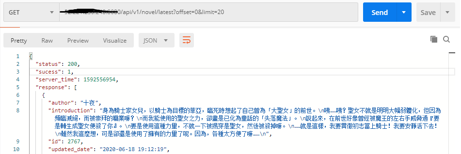

# OpenAcg-Deployer
Deploy OpenAcg anywhere on any cloud service providers


## Server requirements
<ol>
<li>Ubuntu 18.04 or above</li>
<li>Minimum 4GB memory and 2Vcpus</li>
<li>git</li>
<li>uidmap</li>
<li>Inbound TCP port 8080 should open to public</li>
<li>It's ok to deploy the whole application anywhere except for <b>Japan and mainland China</b> due to resource copyright issues, otherwise middleware gateway would block all incoming requests</li>
</ol>

## Cloud Server Creation

**Step 1**
Create a fresh ubuntu 18.04 VM on AWS


**Step 2**
Configure Security group, open port 8080 to public for testing purpose.


**Step 3**
Launch VM


## Deployment

### Install required dependencies

```
sudo apt-get update
sudo apt-get install -y build-essential curl uidmap git
```

```
git clone https://github.com/821wkli/OpenAcg-Deployer

cd ./OpenAcg-Deployer

chmod +x ./deploy.sh

./deploy.sh
```
### Update env variables
```
source ~/.bashrc
```
### Start docker engine
```
systemctl --user start docker
```
### Activate OpenAcg
```
docker-compose up -d
```

## Test api Example
```
http://server-ip-address:8080/api/v1/novel/latest?offset=0&limit=20
```
### more apis [see here](https://github.com/821wkli/OpenAcg-PWA/blob/master/api-docs.md#fetch-latest-updated-book-list)

### Response



## Meta
The coding test required to deploy the entire system to AWS, but because of video copyright issues, I cannot migrate the animae video streaming service to S3. So, this backend image includes only two services.


